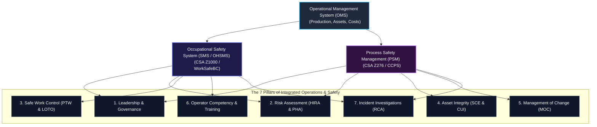

# Integrated Operational & Safety Management System (IOMS) Framework
**Facility Type:** LNG Production, Storage, and Marine Export Facility  
**Jurisdiction:** British Columbia, Canada  
**Primary Standards:** CSA Z1000 (OHS Management), CSA Z276 Clause 11 (Operations & Maintenance), CCPS Risk-Based Process Safety (RBPS)  

---

## 1. The IOMS Architecture
This framework integrates Occupational Health & Safety (SMS) and Process Safety Management (PSM) directly into the core Operational Management System (OMS). Safety is not a standalone function; it is built into the workflow of every operational hour.

---

## 2. Core Pillars & Embedded Controls

### Pillar 1: Leadership, Governance & Accountability
*   **OMS Integration:** Capital allocation, operational KPI setting, and organizational design must reflect safety commitments.
*   **Governing Standards:** WCA s. 21 (Duties of Employers), CSA Z1000 Clause 4.
*   **Key Controls & Elements:**
    1.  **Safety Leadership Charter:** Signed commitment from the Executive team establishing that operations will shut down immediately if safe conditions cannot be maintained.
    2.  **Safety Critical Roles Matrix:** Clear definition of operations personnel with legal responsibility under the *Workers Compensation Act*.
    3.  **Active Field Presence Program:** Mandatory safety leadership walkdowns by superintendents and directors with documented coaching conversations.

### Pillar 2: Risk Identification, Assessment & Control
*   **OMS Integration:** Risk assessments must dictate standard operating procedures (SOPs) and maintenance scheduling.
*   **Governing Standards:** WorkSafeBC OHS Reg 3.14, CSA Z1002 (Hazard Identification & Risk Assessment), CSA Z276 Clause 10.
*   **Key Controls & Elements:**
    1.  **Process Hazard Analysis (PHA):** Mandatory HAZOP (Hazard & Operability) and LOPA (Layer of Protection Analysis) completed and signed off for all operational loops before start-up.
    2.  **Field-Level Hazard Assessment (FLHA):** Daily, pre-task hazard assessments completed by field operators and technicians prior to executing any maintenance or operational shift.
    3.  **Safe Operating Limits (SOL) Registry:** Clear documentation of critical process envelopes (temperature, pressure, flow) with mandated automatic trip actions when exceeded.

### Pillar 3: Safe Systems of Work (Work Control)
*   **OMS Integration:** The Permit to Work (PTW) system is the daily gateway for all maintenance and operations execution.
*   **Governing Standards:** WorkSafeBC OHS Reg Parts 9 (Confined Space), 10 (LOTO), and 23 (Oil & Gas).
*   **Key Controls & Elements:**
    1.  **Integrated Permit to Work (PTW):** A single electronic or physical permit system tracking Hot Work, Confined Space Entry, and Ground Disturbance.
    2.  **Operational Lock-Out/Tag-Out (LOTO):** Dual-isolation policy (Double Block & Bleed or Blinding) for all line breaking involving hydrocarbons or high-pressure steam, verified by zero-energy tests.
    3.  **Marine Safety Zone Enforcement:** Automatic visual and radar exclusion zone monitoring around the terminal and loading jetty.

### Pillar 4: Asset Integrity & Reliability
*   **OMS Integration:** Preventive maintenance cycles must prioritize Safety-Critical Elements (SCEs) over non-safety production systems.
*   **Governing Standards:** BCER LNG Facility Regulation s. 4 & s. 23, CSA Z276 Clause 11.5.
*   **Key Controls & Elements:**
    1.  **Safety-Critical Elements (SCE) Registry:** Identification and tracking of critical barriers (e.g., ESD valves, gas detectors, fire deluge pumps, relief valves).
    2.  **SCE Maintenance Compliance (PM):** Zero-tolerance backlog policy for preventive maintenance on identified SCEs.
    3.  **Corrosion Under Insulation (CUI) Management:** Continuous inspection regime using pulsed eddy current testing and profile radiography on cryogenic piping.

### Pillar 5: Management of Change (MOC)
*   **OMS Integration:** Any modification to equipment, process conditions, software, or organization must go through a formal safety review before execution.
*   **Governing Standards:** CSA Z276 Clause 11.1, CCPS MOC guidelines.
*   **Key Controls & Elements:**
    1.  **MOC Registry & Workflow:** Mandatory review process requiring process safety, operations, and EHS sign-offs before any physical modification.
    2.  **Temporary MOC (T-MOC) Control:** Strict time limits and daily validation for temporary bypasses, temporary piping, or manual control overrides.
    3.  **Pre-Start Safety Review (PSSR):** Physical verification that construction matches design, testing is completed, and operators are trained before an MOC is closed and started up.

### Pillar 6: Operational Readiness & Competency
*   **OMS Integration:** Competency assessment must dictate who is permitted to operate the DCS (Distributed Control System) or perform safety-sensitive field tasks.
*   **Governing Standards:** WorkSafeBC OHS Reg s. 23.3, CSA Z276 Clause 11.2.
*   **Key Controls & Elements:**
    1.  **Control Room Operator (CRO) Competency Matrix:** Mandatory simulator-based certification program covering abnormal situations and emergency shutdowns.
    2.  **Management of Fatigue:** Automated shift log auditing to enforce WorkSafeBC compliance and prevent operator error during startup.
    3.  **Contractor Safety Management:** Prequalification system (e.g., ISNetworld) ensuring all third-party workers match on-site EHS standards.

### Pillar 7: Incident Investigation & Continuous Learning
*   **OMS Integration:** Operations reviews must analyze near-miss data alongside production metrics to identify latent system failures.
*   **Governing Standards:** WCA s. 68-73, WorkSafeBC OHS Reg 3.4.
*   **Key Controls & Elements:**
    1.  **Root Cause Analysis (RCA):** TapRooT® or ICAM methodology mandated for all high-potential (HiPo) near-misses and recordable incidents.
    2.  **Corrective Action Tracking System (CATS):** Automated database tracking RCA actions, with escalations if actions exceed their target completion dates.
    3.  **EHS Alerts & Toolbox Talks:** Weekly dissemination of lessons learned from internally and externally reported industry incidents.
