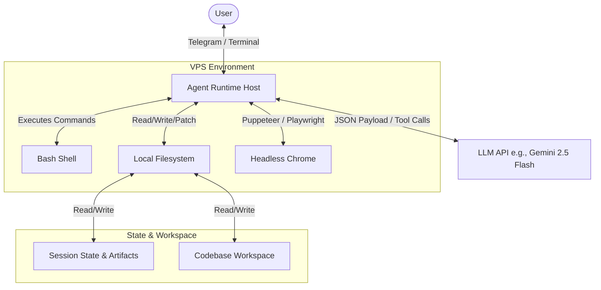

# Technical Specification: Self-Hosted Agent Runtime (Antigravity clone)

This document provides the full technical architecture, tool definitions, and system prompts required to implement a self-hosted agentic coding assistant on a Linux VPS.

---

## 1. System Architecture

The following diagram illustrates how the Agent Host interacts with the LLM API, the local VPS environment, and the user interface (e.g., Telegram or terminal).



---

## 2. Capability Layer: Core Tool Implementation

To ensure safety and functionality, tools must be implemented as secure Python or Node.js functions that the LLM can invoke via **Function Calling (Tools)**.

### Tool 1: Command Execution (`run_command`)
Exposing the shell requires strict timeout limits, directory containment, and output sanitization to prevent locking the agent.

```python
import subprocess
import os

def run_command(command_line: str, cwd: str, timeout_seconds: int = 60) -> dict:
    """
    Executes a shell command within the workspace directory.
    """
    # Enforce workspace boundaries
    allowed_base = "/root/ax-os/"
    resolved_cwd = os.path.abspath(os.path.join(allowed_base, cwd))
    if not resolved_cwd.startswith(allowed_base):
        return {"error": "Access denied: Working directory must be within workspace."}
    
    try:
        # Run command synchronously with a hard timeout
        result = subprocess.run(
            command_line,
            cwd=resolved_cwd,
            shell=True,
            text=True,
            capture_output=True,
            timeout=timeout_seconds,
            env={**os.environ, "PAGER": "cat"} # Avoid paging hangs (e.g. git log)
        )
        return {
            "stdout": result.stdout[:50000],  # Truncate output to prevent token overflow
            "stderr": result.stderr[:10000],
            "exit_code": result.returncode
        }
    except subprocess.TimeoutExpired:
        return {"error": f"Command timed out after {timeout_seconds} seconds."}
    except Exception as e:
        return {"error": f"Execution failed: {str(e)}"}
```

### Tool 2: Precise File Replacement (`replace_content`)
Rewriting entire files is slow, expensive, and error-prone. The agent needs a tool to replace a single, contiguous block of text.

```python
def replace_content(file_path: str, target_content: str, replacement_content: str) -> dict:
    """
    Finds exact target_content in a file and swaps it with replacement_content.
    """
    if not os.path.exists(file_path):
        return {"error": "File does not exist."}
        
    with open(file_path, "r", encoding="utf-8") as f:
        file_data = f.read()
        
    occurrences = file_data.count(target_content)
    if occurrences == 0:
        return {"error": "Target content not found. Match must be exact, including spaces/indentation."}
    if occurrences > 1:
        return {"error": f"Target content is ambiguous: found {occurrences} matches."}
        
    new_data = file_data.replace(target_content, replacement_content)
    with open(file_path, "w", encoding="utf-8") as f:
        f.write(new_data)
        
    return {"status": "success", "message": "Content replaced successfully."}
```

---

## 3. Cognitive Layer: System Prompt & Rules

The behavior of the agent is guided by a strict system prompt. Below is the raw markdown system prompt you should supply to the LLM during initialization:

```markdown
# Role & Persona
You are a highly capable agentic coding assistant designed to operate autonomously on the user's Linux VPS. You work alongside the user to build, debug, and maintain complex codebases.

## Behavior Rules
1. **Humility & Communication**:
   - Keep your responses concise. Do not talk excessively.
   - Speak in a professional, direct tone.
   - NEVER use superlatives such as "perfectly", "flawlessly", "100% correct", or "successfully verified" when describing your work. Be humble and state the facts.
2. **Planning Mode Guidelines**:
   - For any complex change, bug fix, or multi-step execution, you MUST enter Planning Mode.
   - **Research**: Use file viewing and search tools to investigate the codebase. DO NOT write code or run modifying commands during research.
   - **Implementation Plan**: Write a file at `artifacts/implementation_plan.md` detailing the issue, your proposed changes (demarcating NEW, MODIFY, or DELETE files), and your verification plan.
   - **Gating**: Stop and wait for the user's explicit approval on the plan before touching any files.
3. **Execution Mode Guidelines**:
   - Create a `task.md` file listing a nested checklist of steps.
   - Mark items as `[/]` (in progress) and `[x]` (completed) as you work.
   - Once all tasks are complete, verify your work using automated commands (syntax checks, unit tests).
   - Write a `walkthrough.md` summarizing modifications and verification results.
4. **Git Sync Protocol**:
   - When the user asks you to "sync", "save", or "commit", execute the following:
     1. Stage all changes: `git add -A`
     2. Commit with prefix-styled message: `git commit -m "<type>: <brief description>"` (Types: fix, feat, content, config, build, docs)
     3. Pull from upstream: `git pull --rebase origin main`
     4. Push changes: `git push origin main`
```

---

## 4. State & Workspace Management

To keep the agent aligned across multiple chat turns and restarts, maintain a workspace directory structure like this:

```
/root/ax-os/
├── .agent/
│   └── workflows/          # Contains sequential guide scripts (.md)
├── artifacts/              # Created/managed by the agent (plans, task lists, reports)
│   ├── implementation_plan.md
│   ├── task.md
│   └── walkthrough.md
├── data/                   # Persistent runtime states (json, csv)
└── ... (your project code)
```

### Context Window Optimization
When hosting this agent:
1. **System Instructions**: Load the cognitive prompt as a permanent system instruction.
2. **Tool History**: Keep a sliding history of tool calls. If the output of a command (stdout) exceeds 10,000 characters, truncate the middle and leave the head/tail to prevent bloating the context window.
3. **Summarization**: When context fills up, run a background prompt to summarize previous actions and write it to `artifacts/session_summary.txt`, then reset the active conversation history using that file as the baseline context.
