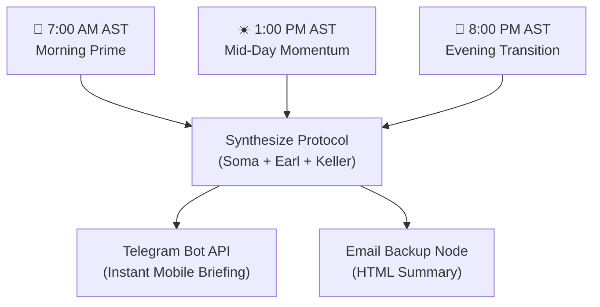

# SOP — n8n 3x Daily Briefing Automation (`Soma + Earl + Keller`)

> **Purpose:** Automated 3-part daily briefing cadence (7:00 AM, 1:00 PM, 8:00 PM AST) sent to Telegram & Email, anchoring physical health (Soma), mindset (Earl), and business focus (Keller) across the entire day.

---

## 🏗️ 3-Part Daily Cadence Breakdown

---

## ⏰ The 3 Daily Touchpoints

### 🌅 1. Morning Prime (7:00 AM AST) — `Soma + Earl + Keller`
- **Soma:** 500ml water + sea salt, 10 min morning sunlight, 30g+ protein breakfast.
- **Earl:** Architect identity, 3 daily seeds (Family First, Operator Calm, Proof over Promise).
- **Keller:** Strategic focus for the day & "The ONE Thing" check.

### ☀️ 2. Mid-Day Momentum (1:00 PM AST) — `Soma + Keller`
- **Soma:** 500ml hydration check, 5-minute walk / posture stretch, clean protein lunch.
- **Keller:** "The ONE Thing" progress audit. Dedicate next 2 hours strictly to high-leverage execution.

### 🌙 3. Evening Transition (8:00 PM AST) — `Earl + Soma`
- **Earl:** Close work tabs, 100% Family Presence transition, 3 Daily Wins check-in.
- **Soma:** Screen blue-light dimming, magnesium/sleep recovery protocol.

---

## ⚙️ How to Import & Activate in n8n

1. **Open n8n:** Open `http://localhost:5678` in your browser (`./start-n8n.ps1`).
2. **Import Workflow:**
   - Click **Workflows** → **Import from File**.
   - Select [`n8n_workflows/daily_3x_os_briefing_automation.json`](file:///c:/Users/Joe/radical_simplicity_ai_os_joe-m/n8n_workflows/daily_3x_os_briefing_automation.json).
3. **Set Telegram / Email Credentials:**
   - Set `TELEGRAM_BOT_TOKEN` & `TELEGRAM_CHAT_ID`.
   - Connect Gmail / SMTP credential for HTML backup.
4. **Toggle Active:** Enable the workflow in top-right corner.

---

## 🧪 Testing the Workflow Manually

- Open the imported workflow in n8n.
- Click **Test Step** or **Execute Workflow** at the bottom.
- Verify that the Markdown briefing outputs cleanly and dispatches to your channels!
