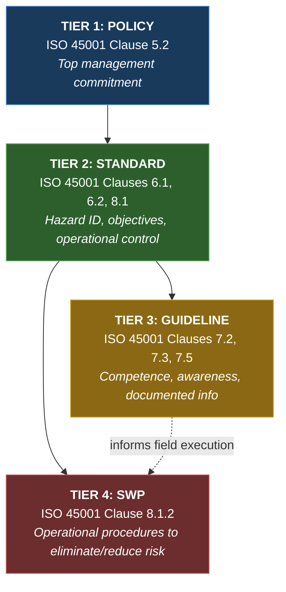
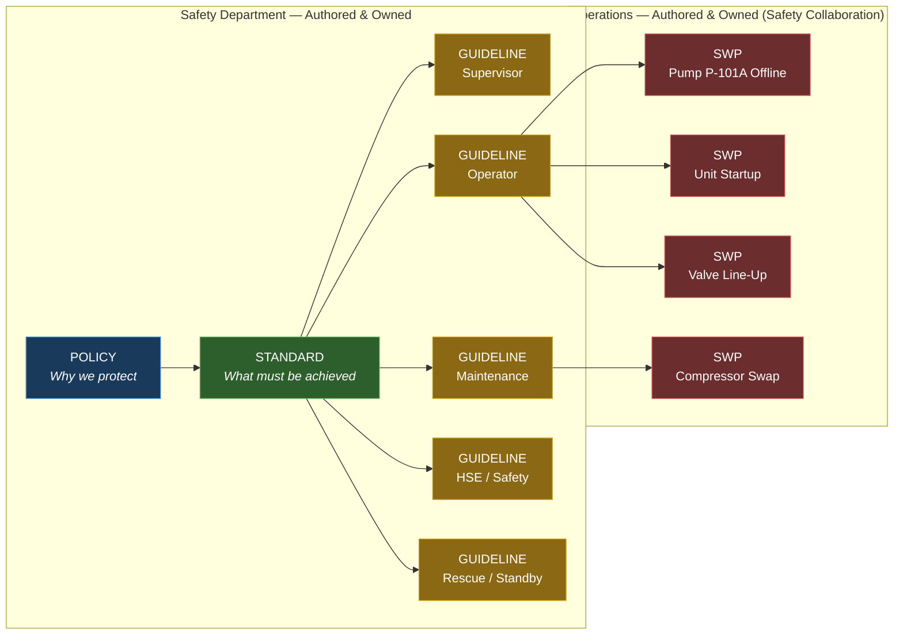
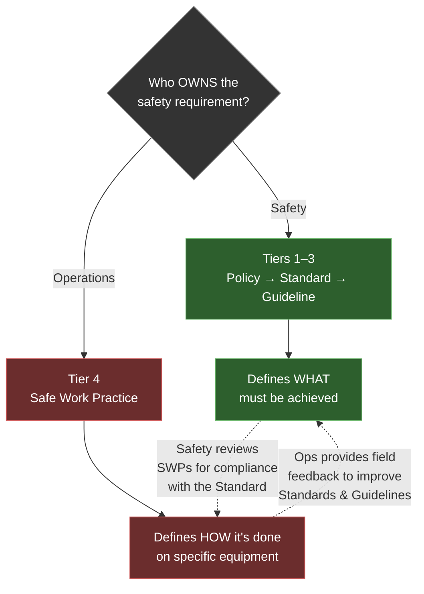
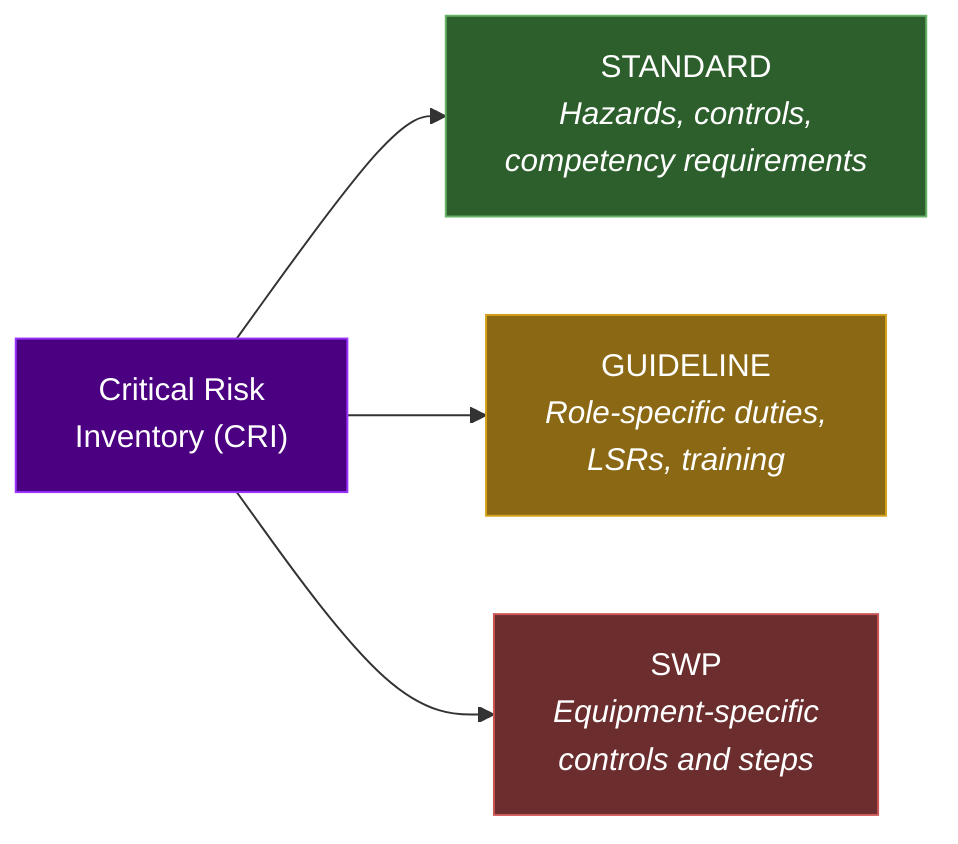

# Safety Documentation Framework

## The Safety Cascade: From Policy to Practice

**Framework Type:** Hierarchical Cascade (4-Tier Pyramid)
**Core Purpose:** Ensure every safety requirement flows from strategic intent (Policy) down to the hands of the person doing the work (SWP), with zero ambiguity on ownership, content, or application at each level.
**ISO 45001:2018 Alignment:** Full compliance — mapped clause-by-clause below.

---

## Visual Architecture

```
┌─────────────────────────────────────────────────────┐
│                                                     │
│                    TIER 1: POLICY                    │
│              "WHY we protect people"                 │
│           Owner: Senior Management / Safety          │
│            ISO 45001 Clause 5.2                      │
│                                                     │
├─────────────────────────────────────────────────────┤
│                                                     │
│                  TIER 2: STANDARD                    │
│             "WHAT must be achieved"                  │
│               Owner: Safety Department               │
│          ISO 45001 Clauses 6.1, 6.2, 8.1            │
│                                                     │
├─────────────────────────────────────────────────────┤
│                                                     │
│          TIER 3: GUIDELINE (One-Pagers)              │
│           "HOW each role applies it"                 │
│               Owner: Safety Department               │
│          ISO 45001 Clauses 7.2, 7.3, 7.5            │
│                                                     │
├─────────────────────────────────────────────────────┤
│                                                     │
│          TIER 4: SAFE WORK PRACTICE (SWP)            │
│     "HOW we do it on THIS equipment / THIS unit"     │
│       Owner: Operations (with Safety collaboration)  │
│          ISO 45001 Clause 8.1.2                      │
│                                                     │
└─────────────────────────────────────────────────────┘
```

---

## Tier Definitions

### Tier 1 — Policy

| Attribute | Detail |
|---|---|
| **Definition** | The overarching declaration of the organization's commitment to occupational health and safety. Sets the strategic direction, core values, and management accountability. |
| **Answers** | "WHY do we protect people? What is our commitment?" |
| **Scope** | Organization-wide. Applies to all employees, contractors, and visitors. |
| **Owner** | Senior Management (signed by the highest-ranking executive on site). Safety department drafts and maintains. |
| **Audience** | Everyone — posted visibly, referenced in orientation. |
| **Length** | 1–2 pages maximum. |
| **Review Cycle** | Annual or upon significant organizational change (Management Review per ISO 45001 Clause 9.3). |
| **ISO 45001 Clause** | **5.2** — OH&S Policy. Must include commitments to: (a) prevention of injury/ill health, (b) legal compliance, (c) consultation with workers, (d) continual improvement. |
| **Example Content** | "This organization is committed to providing a safe and healthy workplace. We will comply with all applicable legislation, eliminate hazards where practicable, and consult with workers on all matters affecting their health and safety." |

---

### Tier 2 — Standard

| Attribute | Detail |
|---|---|
| **Definition** | The detailed requirements document that defines WHAT must be achieved to fulfill the policy. Specifies mandatory controls, performance criteria, roles and responsibilities, and compliance benchmarks. |
| **Answers** | "WHAT are the specific requirements? What must be in place?" |
| **Scope** | Topic-specific (e.g., "Confined Space Entry Standard," "Energy Isolation Standard," "Working at Heights Standard"). |
| **Owner** | Safety Department. Approved by Safety Manager and endorsed by Operations leadership. |
| **Audience** | Safety professionals, supervisors, operations leadership, maintenance leadership. |
| **Length** | 5–15 pages depending on complexity. |
| **Review Cycle** | Every 2 years, or upon incident investigation findings, regulatory change, or Management of Change (MOC). |
| **ISO 45001 Clauses** | **6.1** (Hazard identification, risk assessment), **6.2** (OH&S objectives and planning), **8.1** (Operational planning and control). |
| **Example Content** | "All confined space entries shall require a valid Confined Space Entry Permit. Atmospheric testing for O₂, LEL, and toxic gases shall be completed within 20 minutes of entry. A dedicated standby person shall be present at all times. A rescue plan with staged equipment shall be documented before entry." |

---

### Tier 3 — Guideline (Role-Specific One-Pagers)

| Attribute | Detail |
|---|---|
| **Definition** | A concise, role-specific field reference that translates the Standard into actionable steps for a specific role. Designed for quick access in the field — laminated, posted at workstations, or carried in a pocket. |
| **Answers** | "HOW does MY role apply this standard?" |
| **Scope** | One guideline per role per standard (e.g., "Confined Space — Supervisor One-Pager," "Confined Space — Operator One-Pager," "Confined Space — Rescue Standby One-Pager"). |
| **Owner** | Safety Department. Developed with input from the target role. |
| **Audience** | The specific role named on the one-pager. |
| **Length** | Strictly 1 page (front only, or front-and-back maximum). |
| **Review Cycle** | Aligned with the parent Standard review cycle. Updated immediately if the Standard changes. |
| **ISO 45001 Clauses** | **7.2** (Competence), **7.3** (Awareness), **7.5** (Documented information). |
| **Format Requirements** | See One-Pager Template below. |

**Typical Roles Requiring One-Pagers:**

| Role | Guideline Focus |
|---|---|
| **Supervisor / Front-Line Leader** | Pre-job verification, permit authorization, crew briefing, compliance monitoring, stop-work authority |
| **Operator** | Task execution steps, PPE requirements, monitoring duties, when to escalate |
| **Maintenance Technician** | Isolation verification, tool/equipment requirements, hazard-specific precautions |
| **Safety Advisor / HSE Rep** | Audit criteria, observation focus areas, regulatory references |
| **Rescue / Standby** | Positioning, equipment checks, trigger criteria, rescue execution steps |

---

### Tier 4 — Safe Work Practice (SWP)

| Attribute | Detail |
|---|---|
| **Definition** | Equipment-specific and unit-specific procedures that describe HOW the operations and maintenance teams incorporate the safety requirements into their actual work tasks. These are written by the people who do the work. |
| **Answers** | "HOW do we do THIS task on THIS equipment safely?" |
| **Scope** | Equipment/unit-specific (e.g., "SWP — Taking P-101A Offline for Seal Replacement," "SWP — Bringing Stabilizer Column Online," "SWP — AGRU Amine Pump Swap"). |
| **Owner** | **Operations** — written by operations/maintenance personnel in collaboration with Safety. Safety reviews for compliance with the parent Standard. |
| **Audience** | Operators, maintenance technicians, and supervisors working on the specific equipment or unit. |
| **Length** | As long as needed to be complete. Typically 2–10 pages. May include checklists, P&ID references, and valve line-up sheets. |
| **Review Cycle** | Every 2 years, after any incident involving the equipment, after MOC affecting the equipment, or after turnaround lessons learned. |
| **ISO 45001 Clauses** | **8.1.2** (Eliminating hazards and reducing OH&S risks — operational procedures), **8.2** (Emergency preparedness and response where applicable). |
| **Example Content** | "To take P-101A offline: (1) Notify the control room operator. (2) Confirm P-101B is running and stable. (3) Slowly close discharge valve XV-101A over 2 minutes to avoid water hammer. (4) Close suction valve. (5) Apply LOTO per Standard STD-EI-002. (6) Drain pump casing to closed drain..." |

---

## Governance & Document Control

### Ownership Matrix

| Tier | Drafted By | Reviewed By | Approved By | Maintained By |
|---|---|---|---|---|
| **Policy** | Safety Manager | Operations Manager, Legal | Site Director / VP | Safety Department |
| **Standard** | Safety Advisor / Subject Matter Expert | Cross-functional team (Ops, Maintenance, Safety) | Safety Manager + Operations Manager | Safety Department |
| **Guideline** | Safety Advisor | Target role representatives (field validation) | Safety Manager | Safety Department |
| **SWP** | Operations / Maintenance personnel | Safety Advisor + Supervisor | Operations Superintendent | Operations Department |

### Review Triggers (Beyond Scheduled Reviews)

Any of the following triggers an immediate review of the affected document(s):

- **Incident or near-miss** involving the activity covered by the document
- **Regulatory change** affecting the requirements
- **Management of Change (MOC)** affecting equipment, process, or organization
- **Audit finding** identifying a gap in the document
- **Turnaround / shutdown lessons learned**
- **Worker feedback** identifying a usability or accuracy issue

### Document Numbering Convention (Recommended)

```
POL-[Topic Code]-[Sequence]     → POL-OHS-001 (OH&S Policy)
STD-[Topic Code]-[Sequence]     → STD-CS-001 (Confined Space Standard)
GDL-[Topic Code]-[Role]-[Seq]   → GDL-CS-SUP-001 (Confined Space — Supervisor Guideline)
SWP-[Unit]-[Equipment]-[Seq]    → SWP-AGRU-P101A-001 (AGRU Pump P-101A Offline)
```

---

## ISO 45001:2018 — Full Clause Mapping



### Detailed Clause Traceability

| ISO 45001 Clause | Clause Title | Framework Tier | How It Is Addressed |
|---|---|---|---|
| 5.1 | Leadership and commitment | Policy | Management signs and endorses the Policy |
| 5.2 | OH&S Policy | **Policy** | The Policy document itself |
| 5.3 | Organizational roles, responsibilities | Policy + Standard | Policy sets accountability; Standards define role-specific responsibilities |
| 5.4 | Consultation and participation | All Tiers | Workers participate in SWP development; Guidelines validated by target roles |
| 6.1 | Actions to address risks and opportunities | **Standard** | Standards define hazard identification and risk assessment requirements |
| 6.1.2 | Hazard identification | Standard | Standards specify how hazards are identified for each activity |
| 6.1.3 | Legal and other requirements | Standard | Standards reference applicable legislation and codes |
| 6.2 | OH&S objectives and planning | Standard | Standards set measurable performance criteria |
| 7.1 | Resources | Standard + SWP | Standards define resource requirements; SWPs specify equipment/tools |
| 7.2 | Competence | **Guideline** | One-pagers define what each role must know and do |
| 7.3 | Awareness | **Guideline** | One-pagers ensure workers are aware of their specific obligations |
| 7.4 | Communication | Guideline + SWP | Guidelines and SWPs are the communication vehicles to the field |
| 7.5 | Documented information | All Tiers | The entire framework IS the documented information system |
| 8.1 | Operational planning and control | **Standard + SWP** | Standards set control requirements; SWPs implement them on specific equipment |
| 8.1.2 | Eliminating hazards / reducing risks | **SWP** | SWPs are the step-by-step procedures that eliminate/reduce risks |
| 8.2 | Emergency preparedness and response | Standard + SWP | Emergency standards + unit-specific emergency SWPs |
| 9.1 | Monitoring, measurement, analysis | Standard | Standards define KPIs and monitoring requirements |
| 9.2 | Internal audit | Guideline (HSE role) | HSE one-pager includes audit criteria |
| 9.3 | Management review | Policy | Triggers Policy review cycle |
| 10.2 | Incident, nonconformity, corrective action | All Tiers | Any tier may be revised based on incident findings |
| 10.3 | Continual improvement | All Tiers | Review cycles and triggers ensure continuous improvement |

---

## Document Flow Diagram



---

## Guideline One-Pager Template

Every Tier 3 Guideline follows this standardized one-page format. Designed for lamination, pocket carry, or posting at the workstation.

```
┌──────────────────────────────────────────────────────────────┐
│  [COMPANY LOGO]                              [Document #]    │
│                                                              │
│  ┌──────────────────────────────────────────────────────┐    │
│  │  GUIDELINE: [Standard Topic]                         │    │
│  │  ROLE: [Supervisor / Operator / Maintenance / etc.]  │    │
│  │  Parent Standard: [STD-XX-XXX]                       │    │
│  │  Revision: [X]  |  Date: [YYYY-MM-DD]                │    │
│  └──────────────────────────────────────────────────────┘    │
│                                                              │
│  YOUR RESPONSIBILITIES                                       │
│  ─────────────────────                                       │
│  □ 1. [Action verb] — [specific responsibility]              │
│  □ 2. [Action verb] — [specific responsibility]              │
│  □ 3. [Action verb] — [specific responsibility]              │
│  □ 4. [Action verb] — [specific responsibility]              │
│  □ 5. [Action verb] — [specific responsibility]              │
│                                                              │
│  BEFORE YOU START                                             │
│  ────────────────                                             │
│  □ [Pre-task verification item 1]                            │
│  □ [Pre-task verification item 2]                            │
│  □ [Pre-task verification item 3]                            │
│                                                              │
│  CRITICAL CONTROLS — DO NOT PROCEED WITHOUT                  │
│  ──────────────────────────────────────────                   │
│  ⚠ [Mandatory control 1]                                    │
│  ⚠ [Mandatory control 2]                                    │
│  ⚠ [Mandatory control 3]                                    │
│                                                              │
│  STOP WORK IF                                                │
│  ────────────                                                │
│  🛑 [Condition requiring stop work 1]                        │
│  🛑 [Condition requiring stop work 2]                        │
│  🛑 [Condition requiring stop work 3]                        │
│                                                              │
│  KEY CONTACTS                                                │
│  ────────────                                                │
│  Control Room: [ext/radio channel]                           │
│  Safety Advisor: [ext/radio channel]                         │
│  Emergency: [ext/radio channel]                              │
│                                                              │
│  ┌──────────────────────────────────────────────────────┐    │
│  │  LIFE SAVING RULES APPLICABLE: [LSR-XX, LSR-XX]     │    │
│  │  REQUIRED PPE: [icons or list]                       │    │
│  └──────────────────────────────────────────────────────┘    │
│                                                              │
│  This guideline supports [STD-XX-XXX]. For full              │
│  requirements, refer to the parent Standard.                 │
└──────────────────────────────────────────────────────────────┘
```

---

## SWP Template Structure (Tier 4)

Safe Work Practices follow this structure. Written by Operations/Maintenance with Safety review.

### SWP Header Block

| Field | Content |
|---|---|
| **Document Number** | SWP-[Unit]-[Equipment]-[Sequence] |
| **Title** | [Specific task on specific equipment] |
| **Unit / Area** | [e.g., Gas Pretreatment — Warm End] |
| **Equipment Tag** | [e.g., P-101A, K-201, V-301] |
| **Applicable Standard(s)** | [Parent Standard reference(s)] |
| **Applicable Guideline(s)** | [Related one-pager reference(s)] |
| **Written By** | [Name, Role — Operations/Maintenance] |
| **Reviewed By** | [Name, Role — Safety Advisor] |
| **Approved By** | [Name, Role — Operations Superintendent] |
| **Revision** | [Number] |
| **Date** | [YYYY-MM-DD] |
| **Next Review** | [YYYY-MM-DD] |

### SWP Body Sections

1. **Purpose** — What this SWP covers and why
2. **Scope** — Which equipment, which conditions, which roles
3. **References** — Parent Standard, P&IDs, vendor manuals, regulatory references
4. **Hazards & Controls Summary** — Key hazards for this specific task (pulled from CRI where applicable)
5. **Required PPE** — Task-specific PPE beyond site minimum
6. **Required Permits** — Which permits are needed (Hot Work, Confined Space, LOTO, etc.)
7. **Pre-Task Requirements** — Isolations, notifications, atmospheric testing, etc.
8. **Step-by-Step Procedure** — Numbered, sequential steps with valve tags, setpoints, and verification holds
9. **Post-Task Requirements** — De-isolation, system reinstatement, testing, permit closure
10. **Emergency Actions** — What to do if something goes wrong during the task
11. **Revision History** — Log of changes with dates and reasons

---

## The Critical Distinction — Why This Works



**The key insight:** Safety owns the "what" (Tiers 1–3). Operations owns the "how" (Tier 4). But they collaborate at the boundary — Safety reviews SWPs for compliance with the Standard, and Operations feeds field reality back to improve Standards and Guidelines. This creates a **closed loop** rather than a one-way cascade.

---

## Implementation Sequence

| Phase | Action | Owner | Timeline |
|---|---|---|---|
| 1 | Establish the framework (this document) and get leadership endorsement | Safety Manager | Week 1 |
| 2 | Draft/validate the OH&S Policy (Tier 1) | Safety + Senior Management | Week 2 |
| 3 | Prioritize Standards to write — start with highest-risk CRI items (e.g., Confined Space, LOTO, Working at Heights, H2S) | Safety | Week 2 |
| 4 | Write first Standard (Tier 2) | Safety SME | Weeks 3–4 |
| 5 | Develop role-specific one-pagers (Tier 3) from the completed Standard | Safety | Week 4–5 |
| 6 | Field-validate one-pagers with target roles | Safety + Ops/Maint reps | Week 5 |
| 7 | Write first SWPs (Tier 4) for critical equipment related to the Standard | Operations + Safety | Weeks 5–7 |
| 8 | Repeat Phases 4–7 for each subsequent Standard | All | Ongoing |

---

## Appendix: Connecting to the Critical Risk Inventory (CRI)

The CRI is the **risk intelligence layer** that feeds this documentation framework. Each CRI entry identifies:
- The hazards and consequences (feeds into Standards)
- The controls required (feeds into Standards and SWPs)
- The competency and training requirements (feeds into Guidelines)
- The roles involved (determines which one-pagers are needed)
- The Life Saving Rules applicable (called out on Guidelines)
- The regulatory references (cited in Standards)



---

*Framework designed using MECE logic, Dual Coding (visual + text), and Miller's Law (4 tiers, not 7). Built for ISO 45001:2018 compliance.*

*Document: FWK-SMS-001 | Rev: 0 | Date: 2026-07-19*
